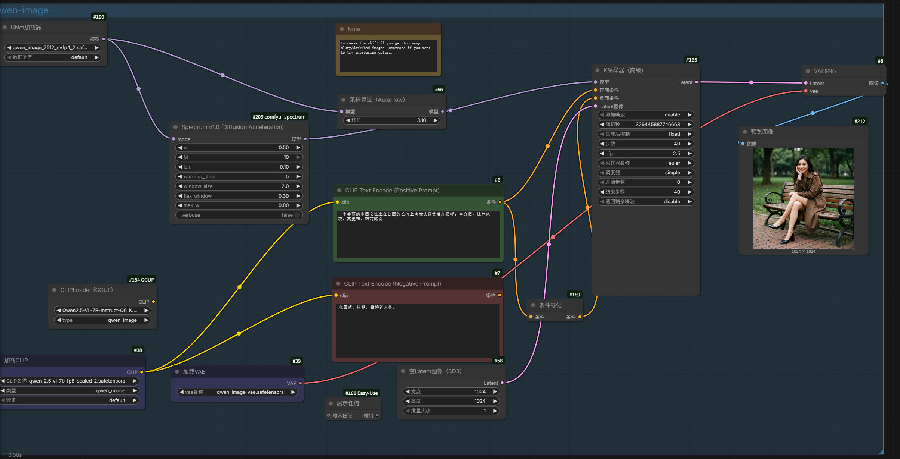
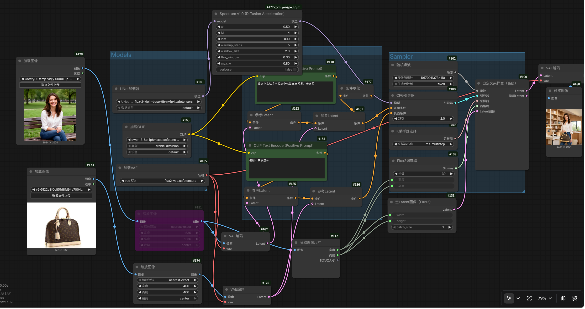
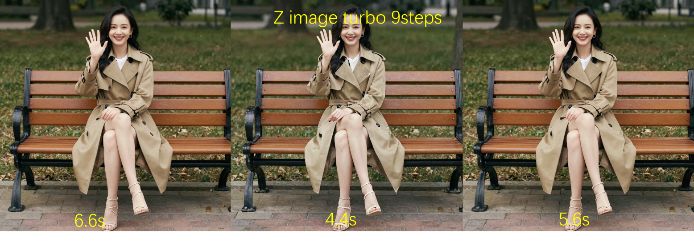
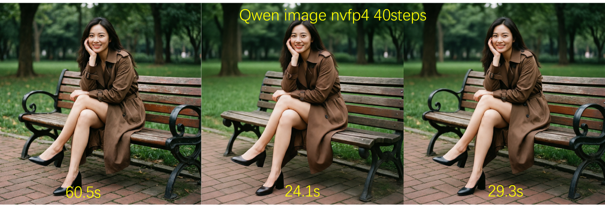

# Spectrum — Diffusion Sampling Acceleration for ComfyUI

[中文说明](README-zh.md) | **English**

**1~4.79× speedup for diffusion sampling** — Unofficial ComfyUI implementation of [Spectrum (CVPR 2026)](https://github.com/hanjq17/Spectrum). Training-free, plug-and-play.

---

## Overview

Spectrum is a **training-free** diffusion sampling acceleration technique. It treats the internal features of the denoiser as functions over time and approximates them with **Chebyshev polynomials** in the spectral domain, enabling prediction and skipping of redundant network forward passes. Unlike prior methods (e.g., local Taylor expansion), Spectrum's approximation error does **not** compound with skip distance, maintaining sample quality even at high speedup ratios.

Currently supported models:

| Model | Detection Type | Quality |
|-------|---------------|---------|
| Klein 9b | Flux-like | Excellent |
| Longcat Image | Flux-like | Excellent |
| FLUX.1 | Flux-like | Excellent |
| Qwen Image (T2I) | MMDiT | Good |
| Z Image Turbo | Lumina2 | Slightly reduced (unique noise_refiner structure) |
| ErnieImage | Ernie | Normal |
| Wan2.2 | Wan | Modest speedup (dual sampling, fewer steps per round) |
| HunyuanVideo 1.5 | Hunyuan | Normal |
| Qwen Image Edit | MMDiT | **Poor** (60 layers with split modulation; not recommended) |
| LTX2.3 | LTX | Untested (hardware-limited) |

The node requires `warmup_steps` (default 3) to build an initial cache, then gradually accelerates. **More total steps = more noticeable speedup.** For lightweight models like Z Image Turbo or Klein, `warmup_steps` can be set to 1.

### Examples

**Text-to-Image** (qwen image):



**Image Editing** (klein base 9b):



### Speed Comparison

All tests on RTX 4090 with default parameters (w=0.5, M=4, window_size=2, flex_window=0.75).

| | Klein 9b | Z Image Turbo | Qwen Image | ErnieImage |
|---|---|---|---|---|
| |  |  |  |  |

---

## How It Works

### 1. Features as Functions of Time

View each feature channel at the output of the denoiser's **last attention block** as a scalar function $h_i(t)$ evolving along the diffusion timeline.

### 2. Global Approximation with Chebyshev Polynomials

Approximate each channel using $M+1$ Chebyshev basis functions:

$$h_i(t) = \sum_{m=0}^{M} c_{m,i} \cdot T_m(\tau), \quad \tau = 2t - 1 \in [-1, 1]$$

where $T_m$ is the $m$-th Chebyshev polynomial ($T_0=1,\; T_1=\tau,\; T_m = 2\tau\cdot T_{m-1} - T_{m-2}$).

**Why Chebyshev?** Its approximation error bound depends only on the degree $M$, not on the forecast horizon (Theorem 3.3). In contrast, local Taylor expansion error grows polynomially with step size, causing quality collapse at large skips.

### 3. Online Ridge Regression

At each actual forward pass, collect block output features $\mathbf{H}$ and corresponding times $\Phi$. Fit coefficients via ridge regression:

$$\mathbf{C} = \arg\min_{\mathbf{C}} \|\Phi\mathbf{C} - \mathbf{H}\|_F^2 + \lambda \|\mathbf{C}\|_F^2$$

Solved as $\mathbf{C} = (\Phi^T\Phi + \lambda I)^{-1}\Phi^T\mathbf{H}$ (negligible cost since $M$ is small).

### 4. Blended Prediction

Final features are a convex combination:

$$h_{\text{mix}} = (\underbrace{1 - w}_{\text{Local Taylor}}) \cdot h_{\text{taylor}} \;+\; \underbrace{w}_{\text{Global Chebyshev}} \cdot h_{\text{cheb}}$$

- **Taylor term**: discrete forward-difference extrapolation from nearest cached points — captures high-frequency details
- **Chebyshev term**: global spectral fit over all cached points — captures long-range trends
- **$w$** controls the blend: larger skips favor Chebyshev, smaller skips favor Taylor

> Analogy: Taylor prediction is like judging a car's next position by its taillight distance — accurate up close, wildly wrong at range. Chebyshev prediction is like reading the car's driving rhythm — you can predict 5 steps ahead almost as well as 1.

---

## Parameters

### `w` — Chebyshev / Taylor Blend Weight

- **Formula**: $h_{\text{mix}} = (1-w) \cdot h_{\text{taylor}} + w \cdot h_{\text{cheb}}$
- **Range**: 0.0 ~ 1.0, **Default** 0.5, **Recommended** 0.3 ~ 0.8
- w=0: pure Taylor (good for short skips); w=1: pure Chebyshev (stable for long skips)
- Dynamically adjusted: larger windows → higher w, capped at `max_w`

### `M` — Chebyshev Polynomial Degree

- **Formula**: $\sum_{m=0}^{M} c_{m,i} \cdot T_m(\tau)$
- **Range**: 1 ~ 10, **Default** 4, **Recommended** 3 ~ 6
- M=2 too coarse; M=4 sweet spot; M=6+ diminishing returns

### `lam` (λ) — Ridge Regularization Strength

- **Formula**: $(\Phi^T\Phi + \lambda I)^{-1}\Phi^T\mathbf{H}$
- **Range**: 0.001 ~ 10.0, **Default** 0.1, **Recommended** 0.01 ~ 1.0
- Too small → numerical instability; too large → underfitting. 0.1 is the paper's optimal value.

### `warmup_steps` — Warmup Steps

- **Range**: 0 ~ 20, **Default** 3, **Recommended** 2 ~ 5
- First N steps always run full precision to build initial cache
- Set to 1 for lightweight models (Klein, Z Image Turbo)
- Set to total steps to disable acceleration entirely

### `window_size` — Initial Skip Interval

- **Formula**: $\mathcal{N}$ (paper's initial window size)
- **Range**: 1.0 ~ 16.0, **Default** 2.0, **Recommended** 1.5 ~ 4.0
- 1 = no skip; 2 = every other step; higher = more aggressive initially

### `flex_window` (α) — Window Growth Rate

- **Formula**: $\alpha$ (paper's adaptive scheduling slope)
- **Range**: 0.0 ~ 4.0, **Default** 0.75, **Recommended** 0.3 ~ 2.0
- Interval sequence: `window, window+α, window+2α, window+3α, ...`
- α=0: fixed schedule; α=0.75: gradual; α=3.0: aggressive
- **Why grow?** Early steps determine layout (error-sensitive), later steps refine details (error-tolerant)
- **Step size 0.01** for precise tuning

> Analogy: flex_window is your **throttle**. α=0 is cruise control, α=0.75 is gradual acceleration, α=3.0 is pedal-to-the-metal. "Slow first, fast later" is optimal.

### `max_w` — Maximum Chebyshev Weight

- **Range**: 0.0 ~ 1.0, **Default** 0.8, **Recommended** 0.6 ~ 0.9
- Upper bound for dynamic w. Raise to 0.9 for extreme speedups; otherwise leave at 0.8.

### `verbose` — Debug Logging

- Prints per-step FWD/SKIP decisions and window sizes for parameter tuning.

---

## Recommended Presets

| Scenario | Parameters | Expected Speedup |
|----------|-----------|-----------------|
| Conservative (quality-first) | w=0.3, M=4, warmup=4, window=2, flex=0.3, max_w=0.6 | ≈2× |
| Balanced (default) | w=0.5, M=4, warmup=3, window=2, flex=0.75, max_w=0.8 | ≈3× |
| Aggressive (speed-first) | w=0.7, M=6, warmup=2, window=2, flex=2.0, max_w=0.9 | ≈4–5× |
| Image Editing | w=0.5, M=4, warmup=4, window=2, flex=0.5, max_w=0.8 | ≈2× |

---

## Image Editing Notes

- **Klein / Longcat Edit**: Single blocks apply uniform modulation, smoothing main/ref token differences. Acceleration quality matches T2I.
- **Qwen Image Edit**: All 60 layers use split timestep_zero modulation. Main token step-to-step variation is 3× that of T2I, causing severe quality degradation. Use conservative parameters or disable acceleration.

---

## Credits

This node was developed with assistance from Claude Code and DeepSeek. Licensed under the MIT License, same as the original project. Feel free to use and contribute.

---

## Citation

```
@article{han2026adaptive,
  title={Adaptive Spectral Feature Forecasting for Diffusion Sampling Acceleration},
  author={Han, Jiaqi and Shi, Juntong and Li, Puheng and Ye, Haotian and Guo, Qiushan and Ermon, Stefano},
  journal={arXiv preprint arXiv:2603.01623},
  year={2026}
}
```
